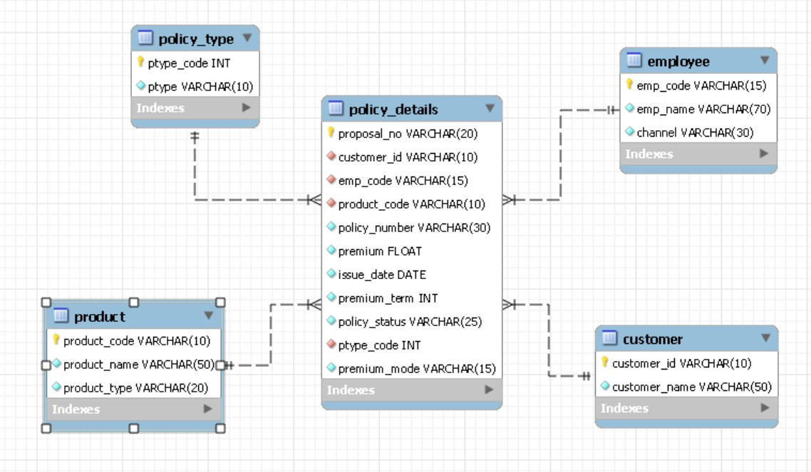

# Life Insurance Data Analysis using SQL

## Project Overview

### Project Title: Life Insurance Analysis

### Database: `LI_DB`

This project demonstrates the implementation of Life Insurance using SQL. It includes creating and managing tables, performing CRUD operations, and executing advanced SQL queries.


## Objective

    1. Set up the Life insurance Database: Create and populate the database with tables for product,
       employee, customer, policy_details and policy_type.
    2. CRUD Operations: Perform Create, Read, Update, and Delete operations on the data.
    3. SQL Administrative Commands: Managing and maintaining SQL database systems efficiently.
    4. Table Modification Commands: Managing and modifying table schema for optimal performance.
    5. CTAS (Create Table As Select): Utilize CTAS to create new tables based on query results.
    6. Advanced SQL Queries: Develop complex queries to analyze and retrieve specific data.

## Project Structure

###    1. Database Setup



- Database Creation: Created a database named `LI_DB`.
- Table Creation: Created tables for product, employee, customer, policy_details, and policy_type. Each table includes relevant columns and relationships.
```sql
-- Create Database 'LI_DB'
drop database if exists LI_DB;
create database if not exists LI_DB;

use LI_DB; # To select the database to work

-- Create table 'product'
drop table if exists product;
create table if not exists product
(
	product_code varchar(10) primary key
   ,product_name varchar(50) not null
);

-- Create table 'customer'
drop table if exists customer;
create table if not exists customer
(
	customer_id varchar(10) primary key
   ,customer_name varchar(50) not null
);

-- Create table 'employee'
drop table if exists employee;
create table if not exists employee
(
	emp_code varchar(15) primary key
   ,emp_name varchar(70) not null
);

-- Create table 'policy_type'
drop table if exists policy_type;
Create table if not exists policy_type(
 ptype_code int primary key
,ptype varchar(10) not null
);

-- Create table 'policy_details'
drop table if exists policy_details;
create table if not exists policy_details
(
	proposal_no varchar(20) primary key
   ,customer_id varchar(10) not null
   ,emp_code varchar(15) not null
   ,product_code varchar(10) not null
   ,policy_number varchar(30) not null
   ,premium float not null
   ,issue_date date not null
   ,premium_term int not null
   ,policy_status varchar(25) not null
   ,ptype_code int not null
   ,premium_mode varchar(15) not null
   ,foreign key (customer_id) references customer(customer_id)
   ,foreign key (emp_code) references employee(emp_code)
   ,foreign key (product_code) references product(product_code)
   ,foreign key (ptype_code) references policy_type(ptype_code)
);

```
### 2. CRUD Operations

- #### Create: Create tables and insert data into the tables.
  ##### 1. Creation involves three main steps: creating the database, creating tables, and adding data: database and tables already established the next step involves populating the tables with data, mostly data import to the databases through CSV files.
  ##### 2. Manual Data Import Method
```sql

insert into policy_type
 (ptype_code, ptype)
values
 (4999, 'New')
,(3999, 'Renewal');
```
- #### Read: Retrieve and display data from various tables.
```sql
select * from product;
select * from customer;
select * from employee;
select * from policy_details;
select * from policy_type;
```
- #### Update: Update record in the policy_type table.
```sql
#Update Record
update policy_type
set ptype = 'NewPolicy'
where ptype = 'New';

```
- #### Delete: Remove records from the tables as needed.
```sql
truncate table employee; #removes all rows from a specified table

delete from employee
where emp_code is null; #delete all rows from employee where conditions are met
```
### 3. SQL Administrative Commands
- #### SQL Administrative Commands: Managing and maintaining SQL database systems efficiently.
```sql
show databases; #displays all databases on the server

show tables; #displays all tables in the current database

show columns in product; # 1. displays column information for a specified table

show columns from product; # 2. displays column information for a specified table

show index from product; # 1. displays index information for a specified table
show index in product; # 2. displays index information for a specified table
show indexes in product; # 3. displays index information for a specified table
show indexes from product; # 4. displays index information for a specified table
```
- #### Check all tables in the current database
```sql

```

### 4. Table Modification Commands: Managing and modifying table schema for optimal performance
- #### Add Column:
```sql
alter table product
add column product_type varchar(20) not null;
```
- #### Drop Column:
```sql
alter table employee
drop column channel;
```
- #### Rename Table:
```sql
alter table emp
rename to employee;
```
- #### Modify Column schema:
```sql
alter table employee
modify channel varchar(30) null;
```
- #### Change Column Name (Rename Column):
```sql
alter table employee
change channels channel varchar(30) not null;
	#Renaming a column often requires updating its data type
```
### 5. CTAS (Create Table As Select)
- #### CTAS (Create Table As Select): Utilize CTAS to create new tables based on query results.
```sql
drop table if exists employee_sales;
create table employee_sales as
select emp_name, count(proposal_no) as total_sales
from employee as emp
join policy_details as pd
	on emp.emp_code = pd.emp_code
group by emp_name
order by total_sales desc;

select * from employee_sales;
```
### 6. Advanced SQL Queries: Develop complex queries to analyze and retrieve specific data
- #### Where Clause
  ##### 1. Retrieve all records with a premium value of 100,000 or higher.
```sql
select * 
from policy_details
where premium >= 100000;
```
  ##### 2. Retrieve all policies issued after '2022-01-01'.
```sql
select * 
from policy_details
where issue_date > '2022-01-01';
```
  ##### 3. Retrieve all policies with a policy status of 'InForce'.
```sql
select * 
from policy_details
where policy_status = 'InForce';
```
  ##### 4. Retrieve all policies with a  premium mode of 'Single'.
```sql
select * 
from policy_details
where premium_mode = 'Single';
```
- #### Group By Clause
  ##### 1. Retrieve the total premium amount for each policy status.
```sql
select policy_status, sum(premium)
from policy_details
group by policy_status;
```
  ##### 2. Retrieve all the policies issued for each product code.
```sql
select product_code, count(proposal_no)
from policy_details
group by product_code;
```
  ##### 3. Retrieve the average premium term for each premium mode.
```sql
select premium_mode, avg(premium)
from policy_details
group by premium_mode;
```
  ##### 4. Retrieve the total sales of each employee.
```sql
select emp_name, count(proposal_no)
from employee
join policy_details
	on employee.emp_code = policy_details.emp_code
group by employee.emp_code;
```
- #### Order By Clause
  ##### 1. Retrieve all policies in ascending order of their issue dates.
```sql
select *
from policy_details
order by issue_date;
```
  ##### 2. Retrieve all the proposals in descending order of their premium amounts.
```sql
select *
from policy_details
order by premium desc;
```
  ##### 3. Retrieve all policies in ascending order of their premium terms.
```sql
select *
from policy_details
order by premium_term;
```
  ##### 4. Retrieved all policies by product name in alphabetical order.
```sql
select *
from policy_details
inner join product
	on policy_details.product_code = product.Product_code
order by product_name;
```
- #### Having Clause
  ##### 1. Retrieve all Which employee (emp_code) has issued more than 10 policies?.
```sql

```
  ##### 2. Retrieve all the policy statuses with a total premium amount greater than 1000000.
```sql

```
  ##### 3. Retrieve all the product codes with an average premium amount greater than 50000?.
```sql

```
  ##### 4. Retrieve the .
```sql

```
- #### Limit Clause


- #### Alias: Gives a temporary name to tables or columns
```sql
select premium_mode, count(proposal_no) as Total
from policy_details
group by premium_mode; #The keyword "AS" is used to give an alias to a table or column.
```
- #### Joins: Combines related table data
  ##### 1. Inner Join: Returns only the rows that have matching values in both tables.
```sql
select ptype as Business_type, count(proposal_no) as  Total_sales, sum(premium) Total_revenue
from policy_details as pd
inner join policy_type pt
	on pd.ptype_code = pt.ptype_code
group by Business_type
order by Business_type;
```
  ##### 2. SQL Joins: The Ultimate Data Connection
  #### [Mastering in SQL Joins](https://gist.github.com/rachelhyman/b1f109155c9dafffe618)

### Some Other Things
#### [Project1](https://gist.github.com/rachelhyman/b1f109155c9dafffe618)
#### [Project2](https://gist.github.com/rachelhyman/b1f109155c9dafffe618)

### Conclusion
